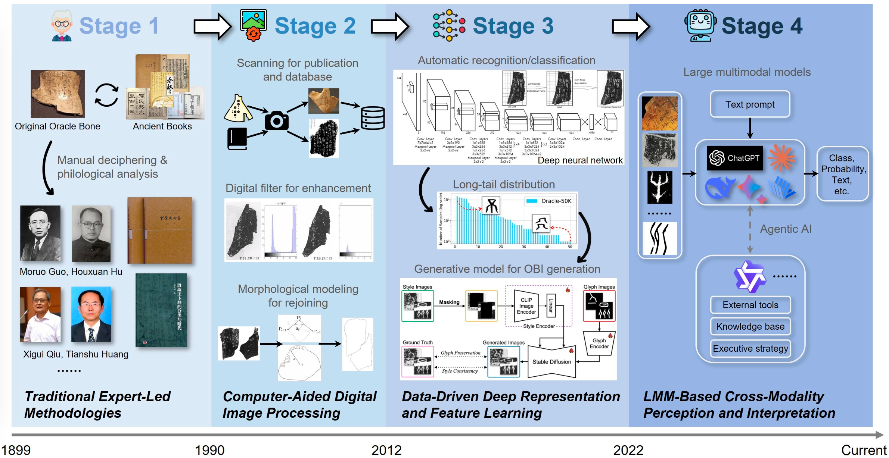

# Oracle Bone Inscriptions Information Processing: A Comprehensive Survey

This repository accompanies the survey *Oracle Bone Inscriptions Information Processing: A Comprehensive Survey* and systematically organizes benchmarks and resources across oracle bone character recognition, fragment rejoining, classification and retrieval, decipherment, and related multimodal tasks. It aims to serve as a collection for reporting progress in the field of Oracle Bone Inscriptions Processing.

**We will continuously maintain and update this repository to ensure long-term value for the community.**



**Paper:** *Coming soon*  
**Project Page:** *This repository*

---

## Contributions

We warmly welcome pull requests (PRs)!

If you contribute **five or more valid OBI-related benchmarks or datasets** with relevant details (task type, paper link, and project page if available), your contribution will be acknowledged in the next update of the survey’s *Acknowledgment* section.

If you find this repository useful, please consider giving us a ⭐. Thank you for your support!

---

## Citation

If our work is helpful in your research, please cite our survey as:

```bibtex
@article{obi_information_processing_survey,
  title  = {Oracle Bone Inscriptions Information Processing: A Comprehensive Survey},
  author = {To be updated},
  year   = {2025}
}
```

## Table of Contents

1. [Recognition](#recognition)
2. [Rejoining](#rejoining)
3. [Classification and Retrieval](#classification-and-retrieval)
4. [Decipherment](#decipherment)
5. [Others](#others)


---

## Recognition
|        Dataset         |                             Paper                              |                        Project Page                         |
| :--------------------: | :-------------------------------------------------------------: | :----------------------------------------------------------: |
|  YinQiWenYuan_detection  | YinQiWenYuan: Oracle Bone Character Detection Dataset | [Website](https://jgw.aynu.edu.cn/home/down/detail/index.html?sysid=3) |
|     OracleBone-8000     | [AI-Powered Oracle Bone Inscriptions Recognition and Fragments Rejoining](https://www.ijcai.org/proceedings/2020/779) | *N/A* |
|         ACCID          | [Toward Zero-shot Character Recognition: A Gold Standard Dataset with Radical-level Annotations](https://arxiv.org/abs/2308.00655) | *N/A* |
|          O2BR          | [OBI-Bench: Can LMMs Aid in Study of Ancient Script on Oracle Bones?](https://arxiv.org/abs/2412.01175) | [Github](https://github.com/zijianchen98/OBI-Bench) |


## Rejoining
|    Dataset     |                              Paper                              |                     Project Page                      |
| :------------: | :--------------------------------------------------------------: | :----------------------------------------------------: |
|   OB-Rejoin    | [Data-Driven Oracle Bone Rejoining: A Dataset and Practical Self-Supervised Learning Scheme](https://dl.acm.org/doi/10.1145/3534678.3539050) | *N/A* |
|      COBD      | [SFF-Siam: A New Oracle Bone Rejoining Method Based on Siamese Network](https://ieeexplore.ieee.org/document/10153461) | *N/A* |
|   OBI-rejoin   | [OBI-Bench: Can LMMs Aid in Study of Ancient Script on Oracle Bones?](https://arxiv.org/abs/2412.01175) | [Github](https://github.com/zijianchen98/OBI-Bench) |
|      OBFI      | [Deep Rejoining Model and Dataset of Oracle Bone Fragment Images](https://www.nature.com/articles/s40494-025-01651-9) | *N/A* |

## Classification and Retrieval

|      Dataset       |                             Paper                              |                        Project Page                         |
| :----------------: | :-------------------------------------------------------------: | :----------------------------------------------------------: |
|    Oracle-20k      | [Building Hierarchical Representations for Oracle Character and Sketch Recognition](https://ieeexplore.ieee.org/document/7327196) | *N/A* |
|      OBC306        | [OBC306: A Large-Scale Oracle Bone Character Recognition Dataset](https://ieeexplore.ieee.org/document/8978032) | [Website](https://jgw.aynu.edu.cn/home/down/detail/index.html?sysid=16) |
|    Oracle-AYNU     | [Oracle Character Recognition by Nearest Neighbor Classification with Deep Metric Learning](https://ieeexplore.ieee.org/document/8977960) | *N/A* |
|       HWOBC        | [HWOBC: A Handwriting Oracle Bone Character Recognition Database](https://iopscience.iop.org/article/10.1088/1742-6596/1651/1/012050) | [Website](https://jgw.aynu.edu.cn/home/down/detail/index.html?sysid=2) |
|    Oracle-50k      | [Self-supervised Learning of Orc-Bert Augmentor for Recognizing Few-Shot Oracle Characters](https://dl.acm.org/doi/10.1007/978-3-030-69544-6_39) | [Github](https://github.com/whhamber/Oracle-50K) |
|     OBI-IJDH       | OBI Dataset for IJDH and OBI Recognition Application | [Website](http://www.ihpc.se.ritsumei.ac.jp/obidataset.html) |
|    Oracle-250      | [Recognition of Oracle Radical based on the Capsule network](https://tis.hrbeu.edu.cn/en/oa/darticle.aspx?type=view&id=201904069) | *N/A* |
|   Radical-148      | [Recognition of Oracle Radical based on the Capsule network](https://tis.hrbeu.edu.cn/en/oa/darticle.aspx?type=view&id=201904069) | *N/A* |
|      OBI125        | [Dynamic Dataset Augmentation for Deep Learning-based Oracle Bone Inscriptions Recognition](https://dl.acm.org/doi/abs/10.1145/3532868) | [Website](http://www.ihpc.se.ritsumei.ac.jp/obidataset.html) |
|      OBI-100        | [Improvement of Oracle Bone Inscription Recognition Accuracy: A Deep Learning Perspective](https://www.mdpi.com/2220-9964/11/1/45) | [Website](http://www.ihpc.se.ritsumei.ac.jp/obidataset.html) |
|    Oracle-241      | [Unsupervised Structure-Texture Separation Network for Oracle Character Recognition](https://ieeexplore.ieee.org/document/9757826) | *N/A* |
|       ORCD         | [Radical-based Extract and Recognition Networks for Oracle Character Recognition](https://link.springer.com/article/10.1007/s10032-021-00392-2) | *N/A* |
|       OCCD         | [Radical-based Extract and Recognition Networks for Oracle Character Recognition](https://link.springer.com/article/10.1007/s10032-021-00392-2) | *N/A* |
|     OracleRC       | [RZCR: Zero-shot Character Recognition via Radical-based Reasoning](https://dl.acm.org/doi/10.24963/ijcai.2023/73) | *N/A* |
|   Oracle-MNIST     | [Oracle-MNIST: a Dataset of Oracle Characters for Benchmarking Machine Learning Algorithms](https://www.nature.com/articles/s41597-024-02933-w) | [Github](https://github.com/wm-bupt/oracle-mnist) |
| OBI component 20   | [Component-Level Oracle Bone Inscription Retrieval](https://dl.acm.org/doi/10.1145/3652583.3658116) | [Github](https://github.com/hutt94/Component-Level-OBI-Retrieval) |

## Decipherment

|     Dataset      |                             Paper                              |                        Project Page                         |
| :--------------: | :-------------------------------------------------------------: | :----------------------------------------------------------: |
|     OBI-ECC      | [Study on the Evolution of Chinese Characters Based on Few-shot Learning: From Oracle Bone Inscriptions to Regular Script](https://journals.plos.org/plosone/article?id=10.1371/journal.pone.0272974) | *N/A* |
|      EVOBC       | [An Open Dataset for the Evolution of Oracle Bone Characters: EVOBC](https://arxiv.org/abs/2401.12467) | [Github](https://github.com/RomanticGodVAN/character-Evolution-Dataset) |
|     HUST-OBC     | [An Open Dataset for Oracle Bone Character Recognition and Decipherment](https://www.nature.com/articles/s41597-024-03807-x) | [Github](https://github.com/Pengjie-W/HUST-OBC) |
|     ACCP     | [Puzzle Pieces Picker: Deciphering Ancient Chinese Characters with Radical Reconstruction](https://arxiv.org/abs/2406.03019) | [Github](https://github.com/Pengjie-W/Puzzle-Pieces-Picker) |
|     OracleSem      | [OracleSage: Towards Unified Visual-Linguistic Understanding of Oracle Bone Scripts through Cross-Modal Knowledge Fusion](https://arxiv.org/abs/2411.17837) | *N/A* |
|      GEVOBC      | [A Graph-based Evolutionary Dataset for Oracle Bone Characters from Inscriptions to Modern Chinese Scripts](https://www.nature.com/articles/s40494-025-01951-0) | [Github](https://github.com/BrisksHan/GBEDOBC) |
|      PD-OBS       | [Interpretable Oracle Bone Script Decipherment through Radical and Pictographic Analysis with LVLMs](https://arxiv.org/abs/2508.10113) | [Github](https://github.com/PKXX1943/PD-OBS) |
|   PictOBI-20k    | [PictOBI-20k: Unveiling Large Multimodal Models in Visual Decipherment for Pictographic Oracle Bone Characters](https://arxiv.org/abs/2509.05773) | [Github](https://github.com/OBI-Future/PictOBI-20k) |

## Others
|     Dataset      |                             Paper                              |                        Project Page                         |
| :--------------: | :-------------------------------------------------------------: | :----------------------------------------------------------: |
|       RCRN       | [RCRN: Real-world Character Image Restoration Network via Skeleton Extraction](https://dl.acm.org/doi/10.1145/3503161.3548344) | [Github](https://github.com/daqians/Noisy-character-image-benchmark) |
|      OBIMD       | [Oracle Bone Inscriptions Multi-modal Dataset](https://arxiv.org/abs/2407.03900) | [Hugging Face](https://huggingface.co/datasets/KLOBIP/OBIMD) |
|     RMOBS      | [OracleFusion: Assisting the Decipherment of Oracle Bone Script with Structurally Constrained Semantic Typography](https://arxiv.org/abs/2506.21101) | *N/A* |
|    Oracle-P15k   | [Mitigating Long-tail Distribution in Oracle Bone Inscriptions: Dataset, Model, and Benchmark](https://dl.acm.org/doi/10.1145/3746027.3755067) | [Github](https://github.com/OBI-Future/Oracle-P15K) |
